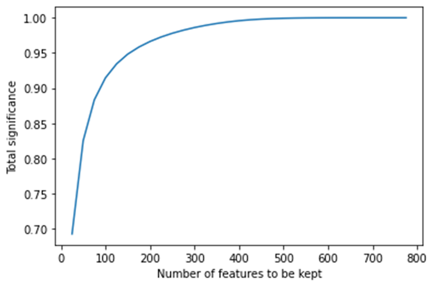
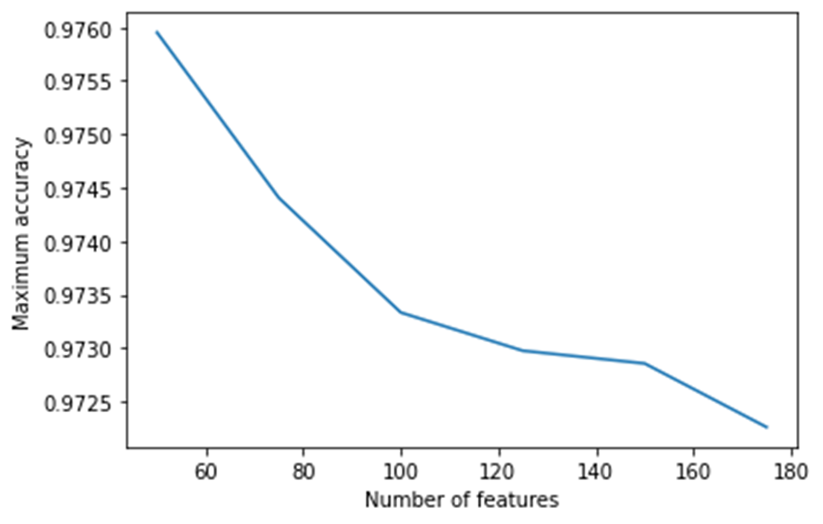

# Digit-Recognizer
____________

**Problem**: Classify images of handwritten numbers (from 0 to 9) using KNN

**Dateset**: The data set (train.csv) includes 42000 labeled examples by 784 features. Each example has the label(represents a number from 0 to 9) and 784 gray-scale pixel values (0-255).

**Dataset source**: https://www.kaggle.com/c/digit-recognizer/data

We divided the "train.csv" file into two sections:
- x_train and y_train: train data, contains 33600 examples. (80% of data)
- x_val and y_val: validation data, contains 8400 examples. (20% of data)

3 Experiements are conducted to find the best accuracy without overfitting:

## Experiment 1
Use KNN, with uniform weights and with distance weights, as provided by the library. Use raw features.

**Results:** distance weight shows very slight better maximum accuracy at k = 3 and k=5.  
    
    uniform weights (All points are weighted equally):
    K= 3 | Accuracy= 0.9695238095238096
    K= 5 | Accuracy= 0.969047619047619

    distance weights (weight points based on their distance):
    K= 3 | Accuracy= 0.9709523809523809
    K= 5 | Accuracy= 0.9705952380952381

## Experiment 2
Extract features using PCA. [Features reduction]

**Results:** we can hold approximately 91% of the significant features using only 100 features out of the full 784.

## Experiment 3
Use KNN, with reduced features, and different values of k, to find maximum accuracy.

**Results:** based on results, KNN was able to get +97% accuracy at k = 5 with only 50 most significant features, instead of 784.

